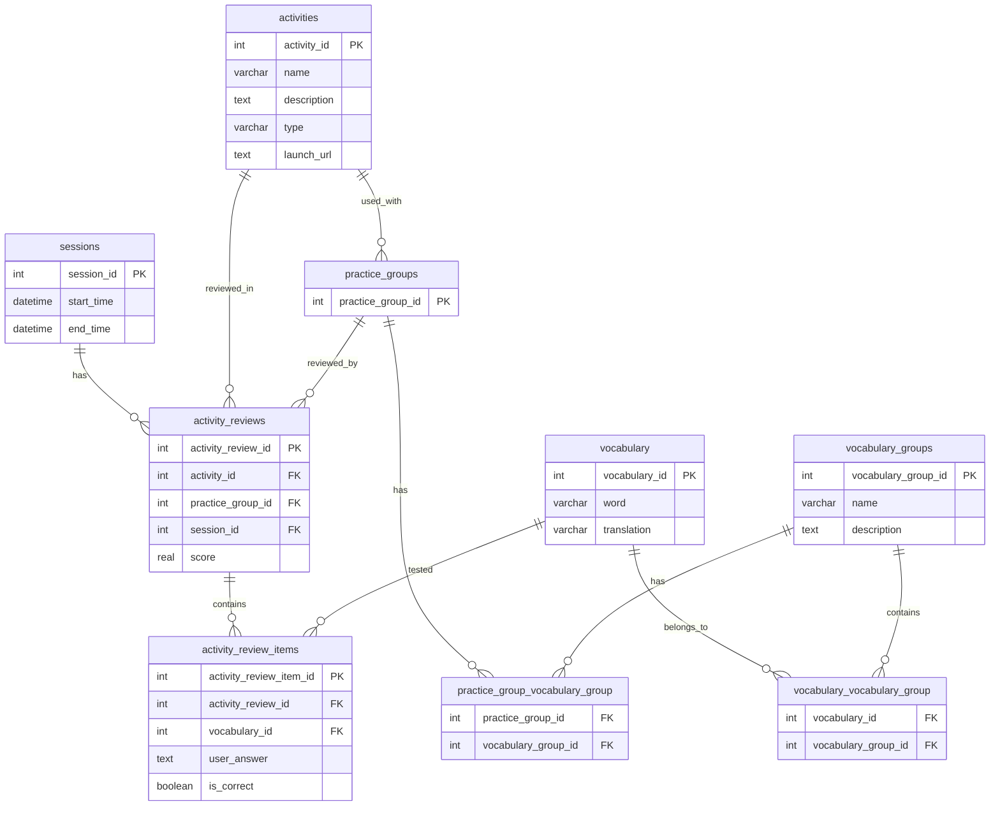

# Technical Specs for Backend

## Business Goal: 
A language learning school wants to build a prototype of learning portal which will act as three things:
1. Inventory of possible vocabulary that can be learned
2. Act as a  Learning record store (LRS), providing correct and wrong score on practice vocabulary
3. A unified launchpad to launch different learning apps

## Core Functionalities

- The database will be built using SQLite3
- The API will always return JSON 
- There is no need for authentication and authorization
- There is no need for user management, it is a single user app


## Database Design

>The application will be using a single database, with multiple tables.

>There are sessions, that represent an individual practice session of one or more activities. Sessions are identified by a unique session id. Sessions have a start time and an end time.

>There are activities, that represent a single practice activity. Activities are identified by a unique activity id. Activities have a name, a description and a type. An activity can be done with a single practice-group at a time.

>There are practice-groups, that represent a many-to-many relationship between vocabulary and vocabulary-groups. Practice-groups are identified by a unique practice-group id.

>There are vocabulary items, that represent a single word or phrase in the target language and its translation in the source language. Vocabulary items are identified by a unique vocabulary id. A vocabulary item can be part of multiple vocabulary-groups.

>There are vocabulary-groups, that represent a collection of vocabulary items. Vocabulary-groups are identified by a unique vocabulary-group id. A vocabulary-group can contain multiple vocabulary items.

>There are activity-reviews, that represent a single review of an activity. Activity-reviews are identified by a unique activity-review id. An activity-review can be done with a single practice-group at a time. Each activity-review has a score, which is the number of correct answers divided by the total number of answers. Activity-reviews are associated with a single activity.

Based on the above, the database schema can be represented as follows:

```SQL
CREATE TABLE sessions (
    session_id INTEGER PRIMARY KEY AUTOINCREMENT,
    start_time DATETIME,
    end_time DATETIME
);

CREATE TABLE session_streaks (
    streak_id INTEGER PRIMARY KEY AUTOINCREMENT,
    session_date DATE UNIQUE,  -- The date of the session (important: make this UNIQUE)
    streak_length INTEGER DEFAULT 1, -- The length of the current streak ending on this date
    FOREIGN KEY (session_date) REFERENCES sessions(start_time) -- Assuming start_time stores the date
);

CREATE TABLE activities (
    activity_id INTEGER PRIMARY KEY AUTOINCREMENT,
    name VARCHAR(255),
    description TEXT,
    type VARCHAR(255),  -- e.g., "vocabulary", "grammar", "pronunciation"
    launch_url TEXT -- For the launchpad functionality
);

CREATE TABLE practice_groups (
    practice_group_id INTEGER PRIMARY KEY AUTOINCREMENT
);

CREATE TABLE vocabulary (
    vocabulary_id INTEGER PRIMARY KEY AUTOINCREMENT,
    word VARCHAR(255),
    translation VARCHAR(255)
);

CREATE TABLE vocabulary_groups (
    vocabulary_group_id INTEGER PRIMARY KEY AUTOINCREMENT,
    name VARCHAR(255),
    description TEXT
);

CREATE TABLE activity_reviews (
    activity_review_id INTEGER PRIMARY KEY AUTOINCREMENT,
    activity_id INTEGER,
    practice_group_id INTEGER,
    session_id INTEGER, -- Link to the session in which the review was done
    score REAL,  -- Calculated as correct answers / total answers
    FOREIGN KEY (activity_id) REFERENCES activities(activity_id),
    FOREIGN KEY (practice_group_id) REFERENCES practice_groups(practice_group_id),
    FOREIGN KEY (session_id) REFERENCES sessions(session_id)
);

CREATE TABLE activity_review_items (  -- New table
    activity_review_item_id INTEGER PRIMARY KEY AUTOINCREMENT,
    activity_review_id INTEGER,  -- Link to the overall review
    vocabulary_id INTEGER,      -- The vocabulary item being tested
    user_answer TEXT,           -- The user's entered answer
    is_correct BOOLEAN,        -- Whether the answer was correct (true/false)
    FOREIGN KEY (activity_review_id) REFERENCES activity_reviews(activity_review_id),
    FOREIGN KEY (vocabulary_id) REFERENCES vocabulary(vocabulary_id)
);

-- Many-to-many relationship between practice_groups and vocabulary_groups
CREATE TABLE practice_group_vocabulary_group (
    practice_group_id INTEGER,
    vocabulary_group_id INTEGER,
    FOREIGN KEY (practice_group_id) REFERENCES practice_groups(practice_group_id),
    FOREIGN KEY (vocabulary_group_id) REFERENCES vocabulary_groups(vocabulary_group_id),
    PRIMARY KEY (practice_group_id, vocabulary_group_id) -- Composite key to prevent duplicates
);

-- Many-to-many relationship between vocabulary and vocabulary_groups
CREATE TABLE vocabulary_vocabulary_group (
    vocabulary_id INTEGER,
    vocabulary_group_id INTEGER,
    FOREIGN KEY (vocabulary_id) REFERENCES vocabulary(vocabulary_id),
    FOREIGN KEY (vocabulary_group_id) REFERENCES vocabulary_groups(vocabulary_group_id),
    PRIMARY KEY (vocabulary_id, vocabulary_group_id) -- Composite key to prevent duplicates
);
```



## API Design

Vocabulary Inventory:

- GET /vocabulary: Returns a list of all vocabulary items. Supports pagination:
    - ?page={page_number}
    - ?per_page={items_per_page}
- GET /vocabulary/{vocabulary_id}: Returns a specific vocabulary item.
- GET /vocabulary_groups: Returns a list of all vocabulary groups.
- GET /vocabulary_groups/{vocabulary_group_id}: Returns a specific vocabulary group.
- GET /vocabulary_in_group/{vocabulary_group_id}: Returns all vocabulary items within a specific group. Supports pagination:
    - ?page={page_number}
    - ?per_page={items_per_page}

Learning Record Store (LRS):

- GET /activities: Returns a list of all activities.
- GET /activities/{activity_id}: Returns a specific activity.
- POST /activity_reviews: Creates a new activity review. Request body: activity_id, practice_group_id, activity_review_items (vocabulary_id, user_answer, is_correct).
- GET /activity_reviews/{activity_review_id}: Returns a specific activity review.
- GET /activity_reviews_by_activity/{activity_id}: Returns all activity reviews for a given activity. Supports pagination:
    - ?page={page_number}
    - ?per_page={items_per_page}
- GET /activity_review_items/{activity_review_id}: Returns all review items from a given review id.
- GET /activity_reviews_by_practice_group/{practice_group_id}: Returns all activity reviews for a given practice group. Supports pagination:
    - ?page={page_number}
    - ?per_page={items_per_page}
- GET /activity_reviews_by_session/{session_id}: Returns all activity reviews for a given session. Supports pagination:
    - ?page={page_number}
    - ?per_page={items_per_page}
- GET /sessions: Returns all sessions.
- GET /sessions/{session_id}: Returns a specific session.
- GET /activity_reviews/{activity_review_id}/score: Returns the calculated score for a specific activity review.

Launchpad:

- GET /activities/{activity_id}/launch: Redirects (or provides the URL) to launch the specified activity.

Practice Groups:

- GET /practice_groups: Returns all practice groups.
- GET /practice_groups/{practice_group_id}: Returns a specific practice group.
- GET /practice_groups_by_vocabulary_group/{vocabulary_group_id}: Returns all practice groups associated with a given vocabulary group.

Calculated Score:

- GET /activity_reviews/{activity_review_id}/score: Returns the calculated score for the specified activity_review_id. This endpoint would perform the SQL query we discussed earlier to calculate the score on the fly.


List of endpoints:
- GET /vocabulary
- GET /vocabulary/{vocabulary_id}
- GET /vocabulary_groups
- GET /vocabulary_groups/{vocabulary_group_id}
- GET /vocabulary_in_group/{vocabulary_group_id}
- GET /activities
- GET /activities/{activity_id}
- POST /activity_reviews
- GET /activity_reviews/{activity_review_id}
- GET /activity_reviews_by_activity/{activity_id}
- GET /activity_review_items/{activity_review_id}
- GET /activity_reviews_by_practice_group/{practice_group_id}
- GET /activity_reviews_by_session/{session_id}
- GET /sessions
- GET /sessions/{session_id}
- GET /activity_reviews/{activity_review_id}/score
- GET /activities/{activity_id}/launch
- GET /practice_groups
- GET /practice_groups/{practice_group_id}
- GET /practice_groups_by_vocabulary_group/{vocabulary_group_id}
- GET /overall_score
- GET /sessions/count
- GET /activities/count
- GET /total_words_practiced
- GET /total_words_available
- GET /sessions/{session_id}/combined_score
- GET /sessions/{session_id}/streak
- GET /sessions/{session_id}/last_session_date
- GET /sessions/{session_id}/last_activity_date
- GET /sessions/{session_id}/last_activity_name
- GET /sessions/{session_id}/last_activity_score

### Aggregation of the current schema and endpoints:

### Endpoints Supported by Current Schema:

- GET /vocabulary: Data directly from the vocabulary table.
- GET /vocabulary/{vocabulary_id}: Data directly from the vocabulary table.
- GET /vocabulary_groups: Data directly from the vocabulary_groups table.
- GET /vocabulary_groups/{vocabulary_group_id}: Data directly from the vocabulary_groups table.
- GET /vocabulary_in_group/{vocabulary_group_id}: Requires a join between vocabulary, vocabulary_vocabulary_group, and vocabulary_groups.
- GET /activities: Data directly from the activities table.
- GET /activities/{activity_id}: Data directly from the activities table.
- POST /activity_reviews: Creates a new review; data goes into activity_reviews and activity_review_items.
- GET /activity_reviews/{activity_review_id}: Data directly from the activity_reviews table, potentially joined with activity_review_items.
- GET /activity_reviews_by_activity/{activity_id}: Requires a join between activity_reviews and activities.
- GET /activity_review_items/{activity_review_id}: Data directly from the activity_review_items table.
- GET /activity_reviews_by_practice_group/{practice_group_id}: Requires a join between activity_reviews and practice_groups.
- GET /activity_reviews_by_session/{session_id}: Data directly from the activity_reviews table.
- GET /sessions: Data directly from the sessions table.
- GET /sessions/{session_id}: Data directly from the sessions table.
- GET /activity_reviews/{activity_review_id}/score: Calculated from activity_review_items.
- GET /activities/{activity_id}/launch: Data directly from the activities table.
- GET /practice_groups: Data directly from the practice_groups table.
- GET /practice_groups/{practice_group_id}: Data directly from the practice_groups table.
- GET /practice_groups_by_vocabulary_group/{vocabulary_group_id}: Requires a join between practice_groups, practice_group_vocabulary_group, and vocabulary_groups.

### Endpoints Requiring Aggregation or Calculation:

- GET /overall_score: Requires aggregating scores from all activity_reviews.
- GET /sessions/count: COUNT query on the sessions table.
- GET /activities/count: COUNT query on the activities table.
- GET /total_words_practiced: Requires counting entries from activity_review_items.
- GET /total_words_available: Needs to count vocabulary items.
- GET /sessions/{session_id}/combined_score: Requires aggregating scores from activity_reviews related to the session.
- GET /sessions/{session_id}/streak: Requires querying the session_streaks table.
- GET /sessions/{session_id}/last_session_date: Requires querying sessions table and finding the most recent date.
- GET /sessions/{session_id}/last_activity_date: Requires joining sessions and activity_reviews and finding the most recent date.
- GET /sessions/{session_id}/last_activity_name: Requires joining sessions, activity_reviews, and activities.
- GET /sessions/{session_id}/last_activity_score: Requires joining sessions, activity_reviews, and activity_review_items.

