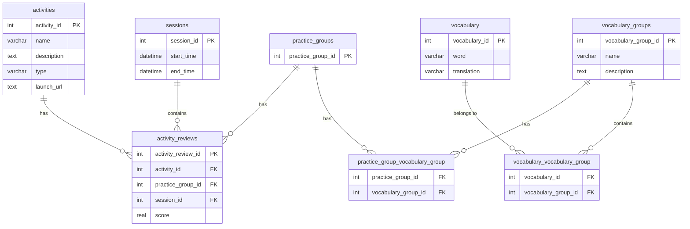

# Technical Specs for Backend

## Business Goal: 
A language learning school wants to build a prototype of learning portal which will act as three things:
1. Inventory of possible vocabulary that can be learned
2. Act as a  Learning record store (LRS), providing correct and wrong score on practice vocabulary
3. A unified launchpad to launch different learning apps

## Core Functionalities

- The database will be built using SQLite3
- The API will always return JSON 
- There is no need for authentication and authorization
- There is no need for user management, it is a single user app


## Database Design

>The application will be using a single database, with multiple tables.

>There are sessions, that represent an individual practice session of one or more activities. Sessions are identified by a unique session id. Sessions have a start time and an end time.

>There are activities, that represent a single practice activity. Activities are identified by a unique activity id. Activities have a name, a description and a type. An activity can be done with a single practice-group at a time.

>There are practice-groups, that represent a many-to-many relationship between vocabulary and vocabulary-groups. Practice-groups are identified by a unique practice-group id.

>There are vocabulary items, that represent a single word or phrase in the target language and its translation in the source language. Vocabulary items are identified by a unique vocabulary id. A vocabulary item can be part of multiple vocabulary-groups.

>There are vocabulary-groups, that represent a collection of vocabulary items. Vocabulary-groups are identified by a unique vocabulary-group id. A vocabulary-group can contain multiple vocabulary items.

>There are activity-reviews, that represent a single review of an activity. Activity-reviews are identified by a unique activity-review id. An activity-review can be done with a single practice-group at a time. Each activity-review has a score, which is the number of correct answers divided by the total number of answers. Activity-reviews are associated with a single activity.

Based on the above, the database schema can be represented as follows:

```SQL
CREATE TABLE sessions (
    session_id INTEGER PRIMARY KEY AUTOINCREMENT,
    start_time DATETIME,
    end_time DATETIME
);

CREATE TABLE activities (
    activity_id INTEGER PRIMARY KEY AUTOINCREMENT,
    name VARCHAR(255),
    description TEXT,
    type VARCHAR(255),  -- e.g., "vocabulary", "grammar", "pronunciation"
    launch_url TEXT -- For the launchpad functionality
);

CREATE TABLE practice_groups (
    practice_group_id INTEGER PRIMARY KEY AUTOINCREMENT
);

CREATE TABLE vocabulary (
    vocabulary_id INTEGER PRIMARY KEY AUTOINCREMENT,
    word VARCHAR(255),
    translation VARCHAR(255)
);

CREATE TABLE vocabulary_groups (
    vocabulary_group_id INTEGER PRIMARY KEY AUTOINCREMENT,
    name VARCHAR(255),
    description TEXT
);

CREATE TABLE activity_reviews (
    activity_review_id INTEGER PRIMARY KEY AUTOINCREMENT,
    activity_id INTEGER,
    practice_group_id INTEGER,
    session_id INTEGER, -- Link to the session in which the review was done
    score REAL,  -- Calculated as correct answers / total answers
    FOREIGN KEY (activity_id) REFERENCES activities(activity_id),
    FOREIGN KEY (practice_group_id) REFERENCES practice_groups(practice_group_id),
    FOREIGN KEY (session_id) REFERENCES sessions(session_id)
);

-- Many-to-many relationship between practice_groups and vocabulary_groups
CREATE TABLE practice_group_vocabulary_group (
    practice_group_id INTEGER,
    vocabulary_group_id INTEGER,
    FOREIGN KEY (practice_group_id) REFERENCES practice_groups(practice_group_id),
    FOREIGN KEY (vocabulary_group_id) REFERENCES vocabulary_groups(vocabulary_group_id),
    PRIMARY KEY (practice_group_id, vocabulary_group_id) -- Composite key to prevent duplicates
);

-- Many-to-many relationship between vocabulary and vocabulary_groups
CREATE TABLE vocabulary_vocabulary_group (
    vocabulary_id INTEGER,
    vocabulary_group_id INTEGER,
    FOREIGN KEY (vocabulary_id) REFERENCES vocabulary(vocabulary_id),
    FOREIGN KEY (vocabulary_group_id) REFERENCES vocabulary_groups(vocabulary_group_id),
    PRIMARY KEY (vocabulary_id, vocabulary_group_id) -- Composite key to prevent duplicates
);




