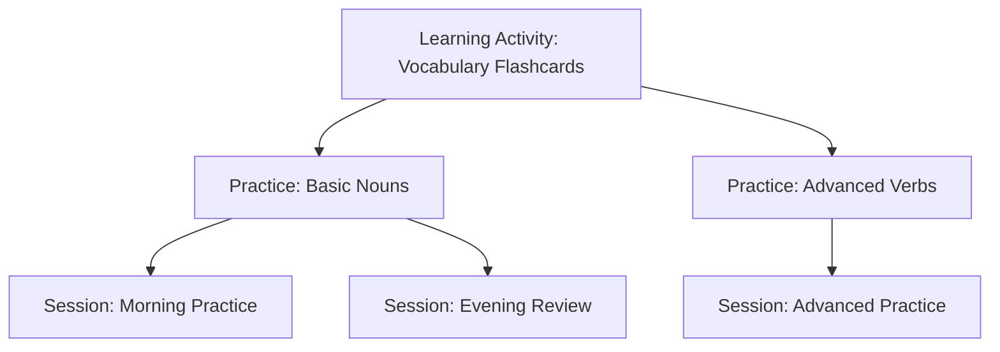

# Language Learning Portal - Data Model 

## Core Design Principles

As a general rule for the Language Learning Portal, we emphasize:

1. **Local-First Architecture**
   - Content served from local server
   - No CORS or remote sources
   - Local font serving instead of webfonts
   - No external dependencies where possible

2. **Privacy by Design**
   - No cookies or tracking
   - No statistics/performance logging
   - No location tracking
   - GDPR compliant without consent requirements
   - No user acceptance warnings needed

3. **Accessibility Focus**
   - WCAG 2.1 AAA compliance target
   - Only deviate if technically unfeasible
   - Performance considerations balanced with accessibility

4. **Future Authentication Preparation**
   - Structure ready for auth
   - Clear separation of concerns
   - Extensible user model

## Current vs. Required Model Analysis

### Existing Implementation
Our current model implements:
- Language pairs with directional independence
- Vocabulary items with language pair associations
- Vocabulary groups with many-to-many relationships
- Activities with vocabulary group associations
- Sessions with attempts and performance tracking
- Local-first architecture with privacy focus

### Required Changes from Project Definition
1. **Study Session Model Refinement**
   - One active session per student at any time
   - Session start/end time tracking
   - Learning Activities within sessions
   - Time tracking per Learning Activity
   - Graceful session handling for errors

2. **Practice vs. Learning Activities Separation**
   - Clear distinction between documentation and training
   - One-to-many relationship from Learning Activity to Practice
   - Enhanced activity metadata and descriptions

3. **Vocabulary Group Enhancements**
   - Support for mixed language pairs in groups
   - Improved group customization
   - Better tracking of vocabulary mastery

## Activity Model Separation

### Concept Overview

The separation between Learning Activities and Practice Activities follows a documentation-implementation pattern:

1. **Learning Activities** (Documentation)
   - Templates/definitions for learning exercises
   - Define what can be practiced
   - Contain metadata about learning objectives
   - Reusable across different practice sessions

2. **Practice Activities** (Implementation)
   - Concrete implementations of Learning Activities
   - Link specific vocabulary groups to learning activities
   - Configure how the learning activity should be practiced
   - Customizable for different difficulty levels

3. **Session Activities** (Execution)
   - Track actual practice sessions
   - Record performance and timing
   - Store attempt data and results
   - Handle session state management

4. **User Profile Integration**

    4.1 **Basic Profile**
    - Display name
    - Language preferences
    - UI preferences (theme, etc.)

    4.2 **Learning Preferences**
    - Default practice duration
    - Preferred activity types
    - Difficulty preferences

    4.3 **Progress Tracking**
    - Personal statistics
    - Learning streaks
    - Achievement tracking


### Activity Flow



## Database Schema


```sql
-- Core Language Tables
CREATE TABLE "languages" (
    language_id SERIAL PRIMARY KEY,
    code CHAR(2) NOT NULL UNIQUE,  -- ISO 639-1
    name VARCHAR(50) NOT NULL,
    native_name VARCHAR(50),
    created_at TIMESTAMP WITH TIME ZONE DEFAULT CURRENT_TIMESTAMP,
    CONSTRAINT valid_language_code CHECK (length(code) = 2)
);

CREATE TABLE "language_pairs" (
    language_pair_id SERIAL PRIMARY KEY,
    source_language_id INTEGER REFERENCES languages(language_id),
    target_language_id INTEGER REFERENCES languages(language_id),
    created_at TIMESTAMP WITH TIME ZONE DEFAULT CURRENT_TIMESTAMP,
    UNIQUE(source_language_id, target_language_id)
);

-- Vocabulary Management
CREATE TABLE "vocabularies" (
    vocabulary_id SERIAL PRIMARY KEY,
    language_pair_id INTEGER REFERENCES language_pairs(language_pair_id),
    word VARCHAR(255) NOT NULL,
    translation VARCHAR(255) NOT NULL,
    part_of_speech VARCHAR(50),
    notes TEXT,
    created_at TIMESTAMP WITH TIME ZONE DEFAULT CURRENT_TIMESTAMP,
    updated_at TIMESTAMP WITH TIME ZONE
);

CREATE TABLE "vocabulary_groups" (
    vocabulary_group_id SERIAL PRIMARY KEY,
    name VARCHAR(255) NOT NULL,
    description TEXT,
    language_pair_id INTEGER REFERENCES language_pairs(language_pair_id),
    custom_order JSONB,
    mastery_rules JSONB DEFAULT '{"threshold": 0.8, "minimum_attempts": 10}',
    last_practiced TIMESTAMP WITH TIME ZONE,
    created_at TIMESTAMP WITH TIME ZONE DEFAULT CURRENT_TIMESTAMP,
    updated_at TIMESTAMP WITH TIME ZONE
);

CREATE TABLE "vocabulary_group_items" (
    vocabulary_group_id INTEGER REFERENCES vocabulary_groups(vocabulary_group_id),
    vocabulary_id INTEGER REFERENCES vocabularies(vocabulary_id),
    position INTEGER,
    created_at TIMESTAMP WITH TIME ZONE DEFAULT CURRENT_TIMESTAMP,
    PRIMARY KEY (vocabulary_group_id, vocabulary_id)
);

-- User Management
CREATE TABLE "users" (
    user_id SERIAL PRIMARY KEY,
    username VARCHAR(255) UNIQUE NOT NULL,
    display_name VARCHAR(255),
    settings JSONB DEFAULT '{}',
    created_at TIMESTAMP WITH TIME ZONE DEFAULT CURRENT_TIMESTAMP,
    last_active TIMESTAMP WITH TIME ZONE
);

CREATE TABLE "user_settings" (
    setting_id SERIAL PRIMARY KEY,
    user_id INTEGER REFERENCES users(user_id),
    key VARCHAR(255) NOT NULL,
    value JSONB,
    created_at TIMESTAMP WITH TIME ZONE DEFAULT CURRENT_TIMESTAMP,
    updated_at TIMESTAMP WITH TIME ZONE,
    UNIQUE (user_id, key)
);

-- Activity System
CREATE TABLE "learning_activities" (
    activity_id SERIAL PRIMARY KEY,
    name VARCHAR(255) NOT NULL,
    description TEXT,
    difficulty_level VARCHAR(20),
    metadata JSONB,
    created_at TIMESTAMP WITH TIME ZONE DEFAULT CURRENT_TIMESTAMP,
    CONSTRAINT valid_difficulty CHECK (
        difficulty_level IN ('beginner', 'intermediate', 'advanced', 'expert')
    )
);

CREATE TABLE "practice_activities" (
    practice_id SERIAL PRIMARY KEY,
    learning_activity_id INTEGER REFERENCES learning_activities(activity_id),
    vocabulary_group_id INTEGER REFERENCES vocabulary_groups(vocabulary_group_id),
    practice_type VARCHAR(50) NOT NULL,
    configuration JSONB,
    created_at TIMESTAMP WITH TIME ZONE DEFAULT CURRENT_TIMESTAMP,
    CONSTRAINT valid_practice_type CHECK (
        practice_type IN ('flashcard', 'quiz', 'typing', 'matching', 'listening')
    )
);

-- Session Management
CREATE TABLE "study_sessions" (
    session_id SERIAL PRIMARY KEY,
    user_id INTEGER REFERENCES users(user_id),
    start_time TIMESTAMP WITH TIME ZONE NOT NULL,
    end_time TIMESTAMP WITH TIME ZONE,
    status VARCHAR(20) CHECK (status IN ('active', 'completed', 'cancelled', 'error')),
    error_details TEXT,
    created_at TIMESTAMP WITH TIME ZONE DEFAULT CURRENT_TIMESTAMP,
    CONSTRAINT one_active_session_per_user UNIQUE (user_id, status) 
        WHERE status = 'active'
);

CREATE TABLE "session_activities" (
    session_activity_id SERIAL PRIMARY KEY,
    session_id INTEGER REFERENCES study_sessions(session_id),
    practice_id INTEGER REFERENCES practice_activities(practice_id),
    start_time TIMESTAMP WITH TIME ZONE NOT NULL,
    end_time TIMESTAMP WITH TIME ZONE,
    duration_seconds INTEGER,
    status VARCHAR(20) CHECK (status IN ('active', 'completed', 'cancelled', 'error')),
    performance_data JSONB,
    created_at TIMESTAMP WITH TIME ZONE DEFAULT CURRENT_TIMESTAMP
);

-- Progress Tracking
CREATE TABLE "vocabulary_progress" (
    progress_id SERIAL PRIMARY KEY,
    user_id INTEGER REFERENCES users(user_id),
    vocabulary_id INTEGER REFERENCES vocabularies(vocabulary_id),
    correct_attempts INTEGER DEFAULT 0,
    total_attempts INTEGER DEFAULT 0,
    last_practiced TIMESTAMP WITH TIME ZONE,
    mastery_level FLOAT DEFAULT 0.0,
    created_at TIMESTAMP WITH TIME ZONE DEFAULT CURRENT_TIMESTAMP,
    updated_at TIMESTAMP WITH TIME ZONE,
    UNIQUE (user_id, vocabulary_id)
);

-- Performance Indexes
CREATE INDEX idx_language_pairs_languages ON language_pairs(source_language_id, target_language_id);
CREATE INDEX idx_vocabularies_language_pair ON vocabularies(language_pair_id);
CREATE INDEX idx_vocabulary_groups_language_pair ON vocabulary_groups(language_pair_id);
CREATE INDEX idx_vocabulary_group_items_group ON vocabulary_group_items(vocabulary_group_id);
CREATE INDEX idx_vocabulary_group_items_vocab ON vocabulary_group_items(vocabulary_id);
CREATE INDEX idx_study_sessions_user_status ON study_sessions(user_id, status);
CREATE INDEX idx_session_activities_session ON session_activities(session_id);
CREATE INDEX idx_practice_activities_learning ON practice_activities(learning_activity_id);
CREATE INDEX idx_vocabulary_groups_last_practiced ON vocabulary_groups(last_practiced);
CREATE INDEX idx_vocabulary_progress_user ON vocabulary_progress(user_id);
CREATE INDEX idx_vocabulary_progress_mastery ON vocabulary_progress(mastery_level);
CREATE INDEX idx_user_settings_key ON user_settings(user_id, key);

-- Example Data: Learning Activity and its Implementations
```sql
-- Example: Flashcard Learning Activity
INSERT INTO learning_activities (name, description, difficulty_level, metadata) VALUES (
    'Vocabulary Flashcards',
    'Practice vocabulary using digital flashcards with spaced repetition',
    'beginner',
    '{
        "learning_objectives": ["vocabulary recognition", "translation recall"],
        "recommended_duration": 300,
        "spaced_repetition": true
    }'
);

-- Example: Two different Practice implementations
INSERT INTO practice_activities (
    learning_activity_id,
    vocabulary_group_id,
    practice_type,
    configuration
) VALUES (
    1,  -- Flashcard activity
    1,  -- Basic Nouns group
    'flashcard',
    '{
        "card_flip_delay": 2000,
        "review_interval": 5,
        "direction": "forward"
    }'
);

INSERT INTO practice_activities (
    learning_activity_id,
    vocabulary_group_id,
    practice_type,
    configuration
) VALUES (
    1,  -- Same Flashcard activity
    2,  -- Advanced Verbs group
    'flashcard',
    '{
        "card_flip_delay": 1500,
        "review_interval": 3,
        "direction": "both",
        "strict_typing": true
    }'
);
```
## Key Relationships Explained

1. **Learning Activity → Practice Activities**
   - One Learning Activity can have multiple Practice Activities
   - Each Practice Activity implements one Learning Activity
   - Practice Activities customize the learning experience

2. **Practice Activity → Session Activities**
   - Practice Activities are templates for actual practice
   - Session Activities record actual practice instances
   - Multiple sessions can use the same Practice Activity

3. **Vocabulary Groups → Practice Activities**
   - Practice Activities target specific Vocabulary Groups
   - One Vocabulary Group can be used in multiple Practice Activities
   - Practice Activities can be configured differently for the same group

## Benefits of This Structure

1. **Reusability**
   - Learning Activities are reusable templates
   - Practice configurations can be saved and reused
   - Session data is separate from activity definitions

2. **Flexibility**
   - Different practice types for the same learning activity
   - Customizable difficulty levels
   - Varied implementations for different learning styles

3. **Progress Tracking**
   - Clear separation of definition and execution
   - Detailed performance tracking
   - Comprehensive progress analytics

4. **Maintainability**
   - Clean separation of concerns
   - Easy to add new activity types
   - Simple to modify existing activities

5. **New Endpoints**
```typescript
// User Profile
GET /api/v1/profile
PUT /api/v1/profile
GET /api/v1/profile/settings
PUT /api/v1/profile/settings

// Enhanced Sessions
POST /api/v1/sessions/start
POST /api/v1/sessions/end
POST /api/v1/sessions/current/activities

// Learning Activities
GET /api/v1/activities/documentation
GET /api/v1/activities/practice
```

6. **Modified Endpoints**
```typescript
// Updated to include user context
GET /api/v1/dashboard/stats?userId={userId}
GET /api/v1/progress?userId={userId}
```

## Implementation Details

### Authentication Preparation
1. **Initial Implementation**
   - Works without authentication
   - User identification through local storage
   - No server-side user sessions
   - Prepared for future auth integration

2. **Future Authentication Ready**
   - User model supports auth fields (currently nullable)
   - API endpoints structured for auth middleware
   - Frontend components auth-aware
   - Clear upgrade path to authenticated system

### Data Privacy Implementation
1. **Local Storage Strategy**
   - All user data stored locally
   - No cloud sync or remote backup
   - Clear data structure for export/import
   - User controls all data retention

2. **Data Retention**
   - No automatic cloud backups
   - Local-only storage
   - Clear data cleanup procedures
   - User-initiated data removal

3. **Performance Data**
   - Stored locally only
   - Aggregated stats without personal identifiers
   - No remote analytics
   - Optional local performance tracking

4. **Error Handling**
   - Minimal error logging
   - No personal data in logs
   - Local-only error tracking
   - Clear error cleanup policy

### Frontend-Specific Considerations
1. **State Management**
   - Local-first state management
   - No remote state synchronization
   - Clear state persistence strategy
   - Efficient state updates

2. **Offline Capabilities**
   - Full offline functionality
   - Local data persistence
   - Graceful offline handling
   - No network requirements

3. **Storage Limitations**
   - Browser storage quotas considered
   - Clear storage management
   - Data cleanup strategies
   - Storage usage monitoring

4. **Asset Management**
   - Local font loading strategy
   - No external CDN dependencies
   - Efficient asset bundling
   - Clear asset update process

### API Versioning Strategy
1. **Version Control**
   - All endpoints under `/api/v1/`
   - Semantic versioning for API changes
   - Clear deprecation process
   - Version compatibility documentation

2. **Breaking Changes**
   - Minimum 6-month deprecation period
   - Clear upgrade paths documented
   - Version support policy
   - Migration guides for major versions

3. **Endpoint Lifecycle**
   - Beta endpoint indication
   - Stable endpoint guarantees
   - Deprecation notifications
   - Version sunset process

## Implementation Phases

### Phase 1: Core Infrastructure
1. Activity System Implementation
2. Local Storage Setup
3. Basic User Profile
4. Frontend Foundation

### Phase 2: Learning Features
1. Session Management
2. Practice Activities
3. Progress Tracking
4. Performance Analytics

### Phase 3: Enhancement
1. Offline Capabilities
2. Data Export/Import
3. Advanced Analytics
4. UI/UX Improvements

## Technical Requirements
## BACKEND-EDIT: Implementation Analysis & Action Plan
### Immediate Actions (Priority 1)
1. **Activity System Core**
   ```mermaid
   graph TD
       A[Activity Models] --> B[Service Layer]
       B --> C[API Endpoints]
       C --> D[Cache Layer]
       D --> E[Frontend Integration]
   ```
   - Implement Activity models with SQLAlchemy
   - Create service layer with privacy focus
   - Add API endpoints with proper documentation
   - Implement caching with local storage


   ```
   ADMIN-EDIT 21-02-2025-10-43: 
   Gave the following instructions to the backend team:
   
   Please formulate a request for the frontend team with all necessary information to implement this cache feature. Then wait till we come back to continue with  the backend tasks. Include all the points you mentione in your request to the frontend team.

   Created document --> docs/Temp/FRONTEND-CACHE-INTEGRATION-21-02-2025-10-43.md
   ```
   ``` 
   ADMIN-EDIT 21-02-2025-13-11: 
   Backend team worked on the activity system core. They created the following document:
   docs/Tasks/Active/PROJECT-CACHE-MONITORING-AND-TESTING.md
   The backend team is now implementing the ### Backend Tasks under the section ### 3. Implementation Tasks
   ```

2. **Session Management**
   ```mermaid
   graph TD
       A[Session Tracking] --> B[Progress Calculation]
       B --> C[Performance Metrics]
       C --> D[Cache Invalidation]
   ```
   - One active session per user
   - Local storage for session data
   - Privacy-focused metrics
   - Efficient cache management

### Technical Implementation Plan

1. **Database Layer (Day 1-2)**
   ```sql
   -- Core Activity Tables
   CREATE TABLE activities (...)
   CREATE TABLE sessions (...)
   CREATE TABLE attempts (...)
   ```
   - Implement models in SQLAlchemy
   - Add indexes for performance
   - Create migration scripts
   - Add data validation

2. **Service Layer (Day 2-3)**
   ```python
   class ActivityService:
       def create_activity(...)
       def get_activity(...)
       def update_activity(...)
       def delete_activity(...)
   ```
   - Activity management
   - Session handling
   - Progress tracking
   - Cache management

3. **API Layer (Day 3-4)**
   ```python
   @router.post("/activities")
   @router.get("/activities/{id}")
   @router.put("/activities/{id}")
   @router.delete("/activities/{id}")
   ```
   - RESTful endpoints
   - Swagger documentation
   - Error handling
   - Response caching

4. **Cache Layer (Day 4)**
   ```python
   @cache_response(prefix="activity")
   async def get_activity(...)
   ```
   - Local file caching
   - Cache invalidation
   - Privacy controls
   - Performance optimization

### Implementation Tasks

1. **Core Activity System**
   - [ ] Create SQLAlchemy models
   - [ ] Implement service layer
   - [ ] Add API endpoints
   - [ ] Write unit tests
   - [ ] Add integration tests

2. **Session Management**
   - [ ] Implement session tracking
   - [ ] Add progress calculation
   - [ ] Create performance metrics
   - [ ] Handle cache invalidation

3. **Frontend Integration**
   - [ ] Create API documentation
   - [ ] Add example responses
   - [ ] Implement error handling
   - [ ] Add TypeScript types

### First Sprint Tasks

```bash
# Day 1: Database Setup
cd backend
python -m alembic revision -m "add_activity_system"
python -m alembic upgrade head

# Day 2: Service Layer
pytest tests/services/test_activity.py
pytest tests/services/test_session.py

# Day 3: API Layer
pytest tests/api/v1/endpoints/test_activities.py
pytest tests/api/v1/endpoints/test_sessions.py

# Day 4: Cache Layer
pytest tests/core/test_cache.py
```

### Integration Points

1. **Frontend Requirements**
   - TypeScript interfaces for all models
   - Real-time progress updates
   - Offline data persistence
   - Error state handling

2. **API Documentation**
   - OpenAPI/Swagger specs
   - Example requests/responses
   - Error codes and handling
   - Rate limiting details

### Next Steps

1. **Immediate Actions**
   ```bash
   # Start implementation
   cd backend
   source .venv/bin/activate
   python -m pytest tests/
   ```

2. **Review Points**
   - Daily progress review
   - Frontend team sync
   - Performance testing
   - Security audit

