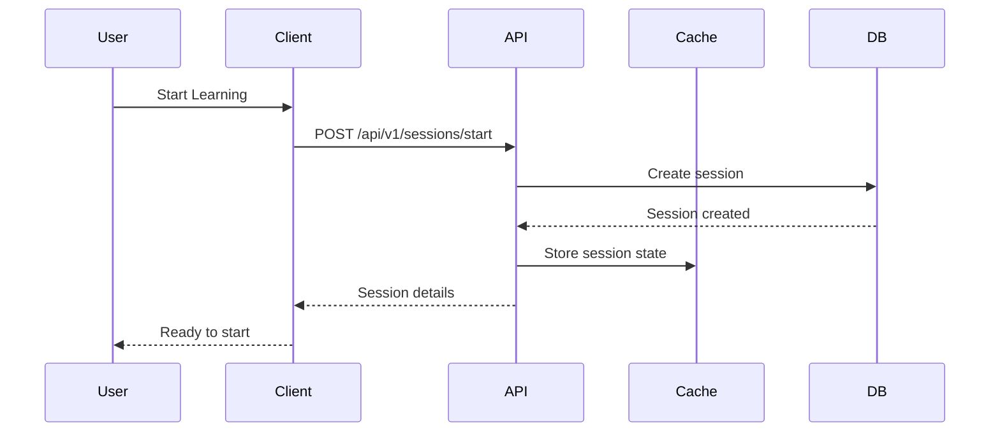
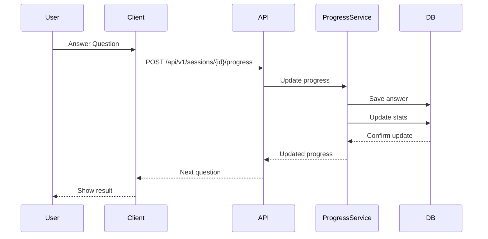
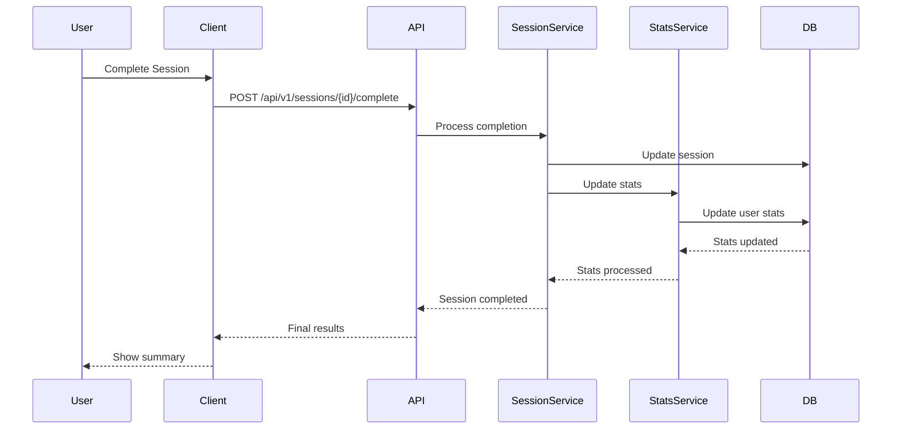

# Session Management API

This document details the API endpoints for managing learning sessions in the Language Learning Portal.

## Session Workflows

### Starting a Learning Session



### Session Progress Updates



### Completing a Session



## API Endpoints

### Start Session

```http
POST /api/v1/sessions/start
```

Start a new learning session.

#### Request Body
```json
{
    "activity_id": 123,
    "settings": {
        "difficulty": "medium",
        "word_count": 20,
        "time_limit": 600
    }
}
```

#### Response
```json
{
    "session_id": "abc123",
    "start_time": "2024-02-17T10:00:00Z",
    "settings": {
        "difficulty": "medium",
        "word_count": 20,
        "time_limit": 600
    },
    "first_item": {
        "word": "hello",
        "type": "translation"
    }
}
```

### Update Progress

```http
POST /api/v1/sessions/{session_id}/progress
```

Update session progress with an answer.

#### Request Body
```json
{
    "item_id": "word123",
    "answer": "hola",
    "time_taken": 3.5
}
```

#### Response
```json
{
    "correct": true,
    "correct_answer": "hola",
    "progress": {
        "completed": 5,
        "remaining": 15,
        "success_rate": 0.8
    },
    "next_item": {
        "word": "goodbye",
        "type": "translation"
    }
}
```

### Complete Session

```http
POST /api/v1/sessions/{session_id}/complete
```

Mark a session as completed.

#### Response
```json
{
    "session_summary": {
        "duration": 450,
        "words_practiced": 20,
        "correct_answers": 16,
        "success_rate": 0.8,
        "streaks": {
            "current": 3,
            "best": 5
        }
    },
    "achievements": [
        {
            "type": "accuracy",
            "name": "Sharp Mind",
            "description": "80% success rate in a session"
        }
    ],
    "next_steps": [
        {
            "type": "practice",
            "description": "Review missed words",
            "word_ids": ["word456", "word789"]
        }
    ]
}
```

### Get Session History

```http
GET /api/v1/sessions/history
```

Get user's session history.

#### Query Parameters
- `limit` (optional): Number of sessions to return (default: 10, max: 50)
- `offset` (optional): Number of sessions to skip (default: 0)
- `activity_id` (optional): Filter by activity
- `from_date` (optional): Start date (ISO format)
- `to_date` (optional): End date (ISO format)

#### Response
```json
{
    "total": 45,
    "sessions": [
        {
            "id": "abc123",
            "activity": {
                "id": 123,
                "name": "Basic Vocabulary"
            },
            "start_time": "2024-02-17T10:00:00Z",
            "end_time": "2024-02-17T10:07:30Z",
            "success_rate": 0.8,
            "words_practiced": 20
        }
    ]
}
```

### Get Session Details

```http
GET /api/v1/sessions/{session_id}
```

Get detailed information about a specific session.

#### Response
```json
{
    "session_id": "abc123",
    "activity": {
        "id": 123,
        "name": "Basic Vocabulary",
        "type": "flashcards"
    },
    "timing": {
        "start_time": "2024-02-17T10:00:00Z",
        "end_time": "2024-02-17T10:07:30Z",
        "duration": 450
    },
    "performance": {
        "words_practiced": 20,
        "correct_answers": 16,
        "incorrect_answers": 4,
        "success_rate": 0.8,
        "average_response_time": 2.5
    },
    "progress": {
        "mastered_words": [
            {
                "word": "hello",
                "translation": "hola",
                "attempts": 3,
                "success_rate": 1.0
            }
        ],
        "needs_practice": [
            {
                "word": "goodbye",
                "translation": "adiós",
                "attempts": 2,
                "success_rate": 0.5
            }
        ]
    }
}
```

## Error Responses

### 404 Not Found
```json
{
    "error": "session_not_found",
    "message": "Session with ID 'abc123' not found"
}
```

### 400 Bad Request
```json
{
    "error": "invalid_request",
    "message": "Session already completed",
    "details": {
        "session_id": "abc123",
        "status": "completed",
        "completion_time": "2024-02-17T10:07:30Z"
    }
}
```

### 429 Too Many Requests
```json
{
    "error": "rate_limit_exceeded",
    "message": "Too many session starts",
    "retry_after": 60
}
```

## WebSocket Events

The session API also supports real-time updates via WebSocket for live progress tracking.

### Connection
```javascript
ws://api.langportal.com/ws/sessions/{session_id}
```

### Event Types

#### Progress Update
```json
{
    "type": "progress_update",
    "data": {
        "completed": 5,
        "remaining": 15,
        "success_rate": 0.8,
        "current_streak": 3
    }
}
```

#### Time Update
```json
{
    "type": "time_update",
    "data": {
        "elapsed": 245,
        "remaining": 355
    }
}
```

#### Session Complete
```json
{
    "type": "session_complete",
    "data": {
        "success_rate": 0.8,
        "duration": 450,
        "words_mastered": 16
    }
}
```

## Rate Limiting

- Session starts: 30 per hour
- Progress updates: 120 per minute
- Session completions: 30 per hour

## Caching

- Session history: Cached for 5 minutes
- Session details: Cached for 1 minute
- Active session state: Cached in Redis
- Progress updates: Real-time, no caching

## Best Practices

1. **Session Management**
   - Always properly complete or cancel sessions
   - Handle connection interruptions gracefully
   - Store progress frequently

2. **Error Handling**
   - Implement retry logic for network issues
   - Cache answers locally before sending
   - Handle timeouts appropriately

3. **Performance**
   - Use WebSocket for real-time updates
   - Batch progress updates when possible
   - Monitor session duration and user engagement

4. **Security**
   - Validate all user inputs
   - Enforce session ownership
   - Monitor for unusual patterns

## Examples

### Starting a Session
```python
import requests

response = requests.post(
    "https://api.langportal.com/v1/sessions/start",
    json={
        "activity_id": 123,
        "settings": {
            "difficulty": "medium",
            "word_count": 20
        }
    }
)

session = response.json()
session_id = session["session_id"]
```

### Updating Progress
```python
import requests

response = requests.post(
    f"https://api.langportal.com/v1/sessions/{session_id}/progress",
    json={
        "item_id": "word123",
        "answer": "hola",
        "time_taken": 3.5
    }
)

progress = response.json()
next_word = progress["next_item"]
```

### WebSocket Connection
```python
import websockets
import json

async def connect_session(session_id):
    async with websockets.connect(
        f"ws://api.langportal.com/ws/sessions/{session_id}"
    ) as ws:
        while True:
            event = await ws.recv()
            data = json.loads(event)
            if data["type"] == "session_complete":
                break
            process_update(data)
``` 