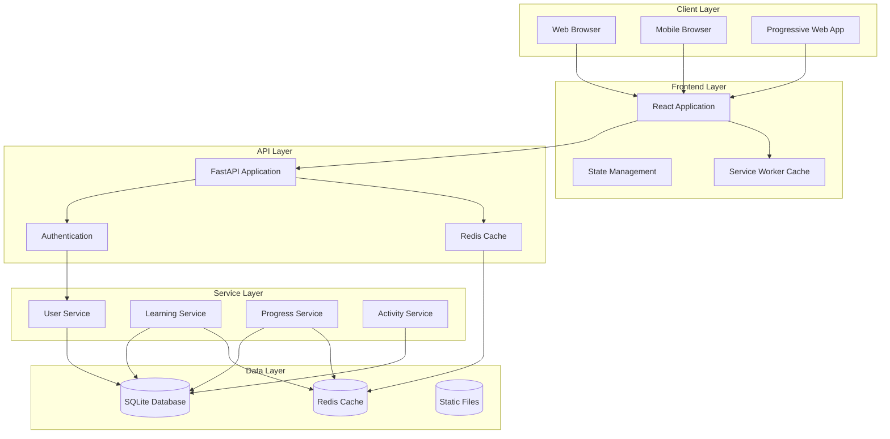
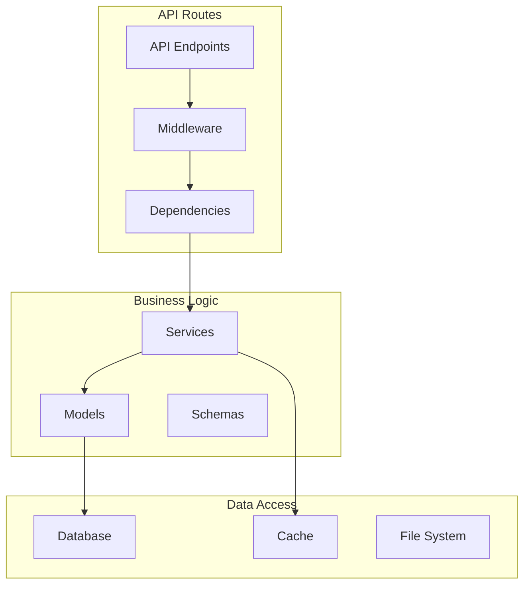
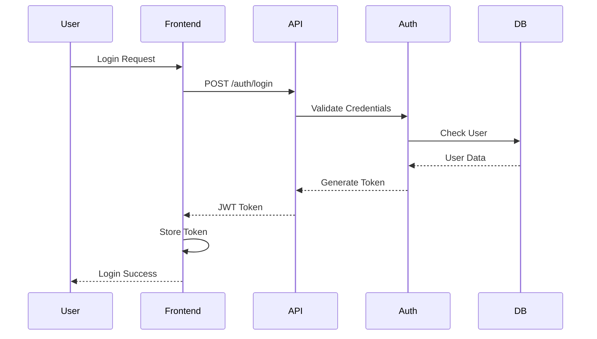
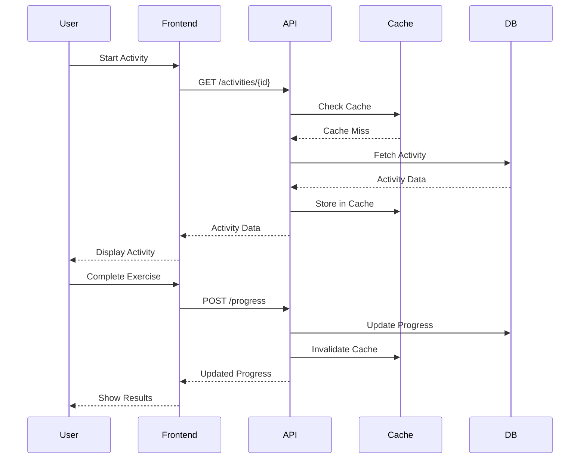
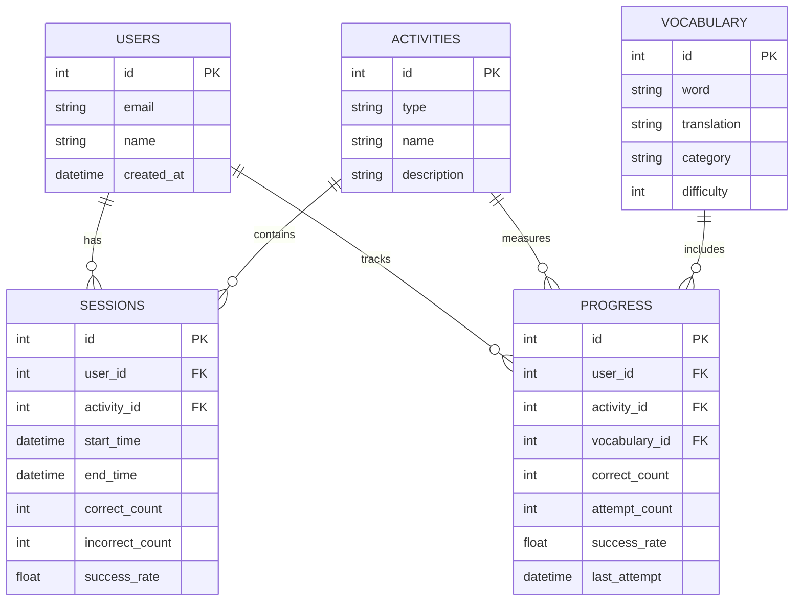
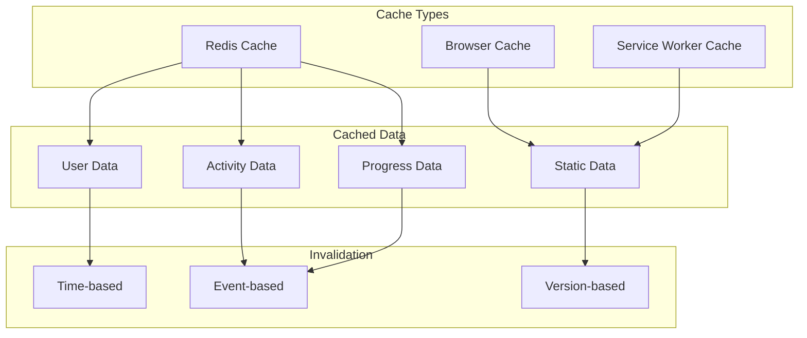
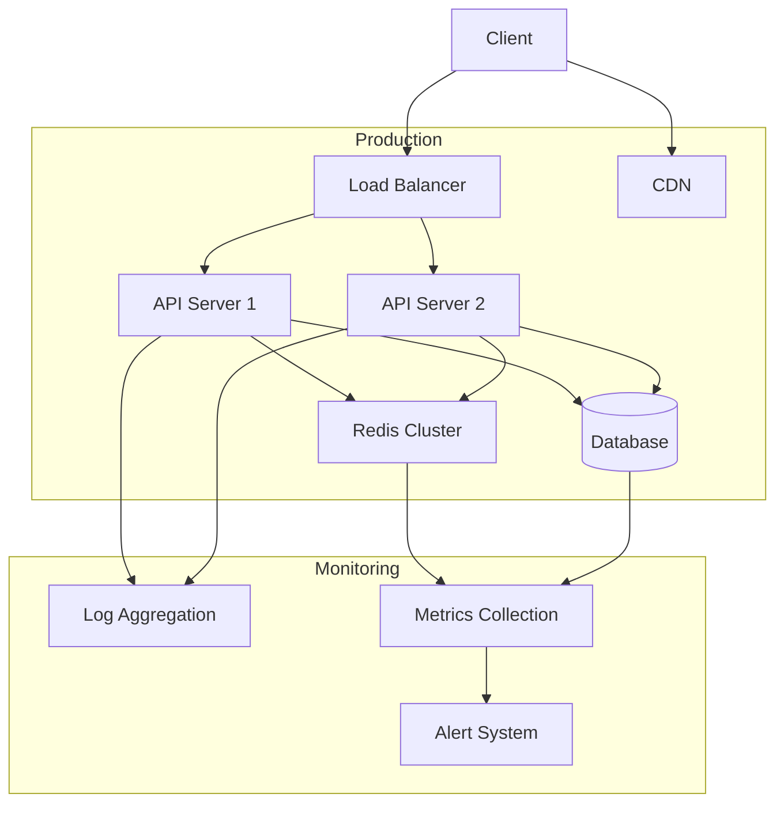
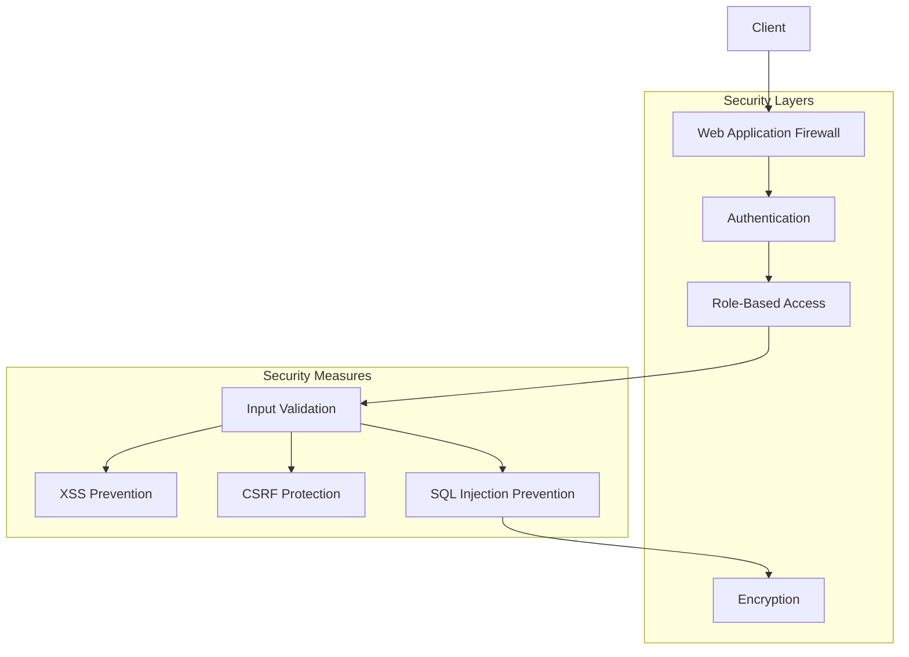
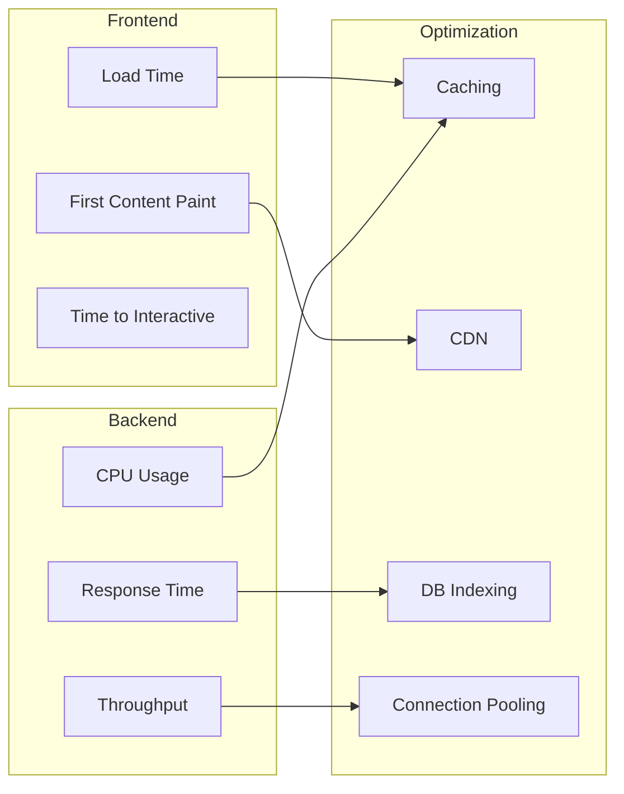
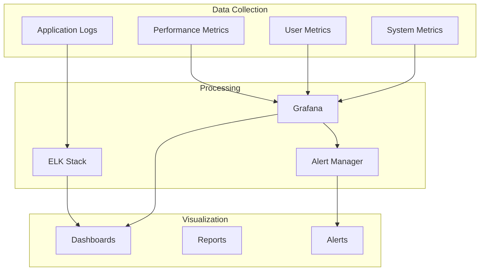

# System Architecture

This document provides a comprehensive overview of the Language Learning Portal's architecture, including system components, data flow, and interactions.

## System Overview



## Component Details

### Frontend Architecture

```mermaid
graph TB
    subgraph Components
        Pages[Pages]
        Components[Reusable Components]
        Hooks[Custom Hooks]
    end

    subgraph State Management
        Store[Redux Store]
        Actions[Actions]
        Reducers[Reducers]
        Middleware[Middleware]
    end

    subgraph API Integration
        APIClient[API Client]
        Interceptors[Interceptors]
        ErrorHandling[Error Handling]
    end

    Pages --> Components
    Components --> Hooks
    Components --> Store
    Store --> Actions
    Actions --> APIClient
    APIClient --> Interceptors
    Interceptors --> ErrorHandling
```

### Backend Architecture



## Data Flow

### Authentication Flow



### Learning Session Flow



## Database Schema



## Caching Strategy



## Deployment Architecture



## Security Architecture



## Performance Optimization



## Monitoring and Logging



This architecture documentation provides a comprehensive view of the system's components and their interactions. For specific implementation details, refer to the respective component documentation. 