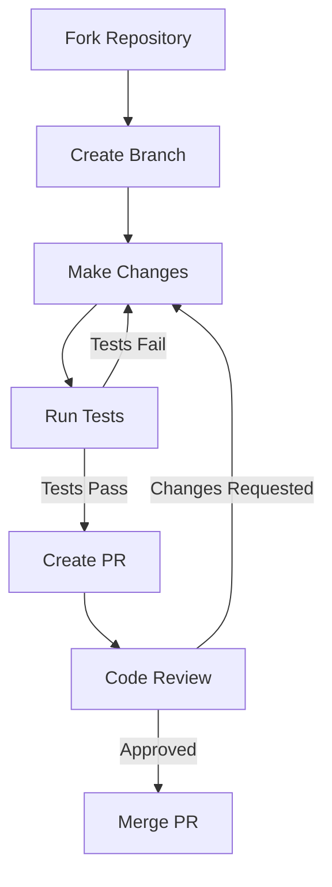
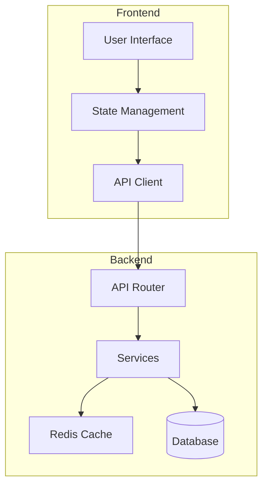
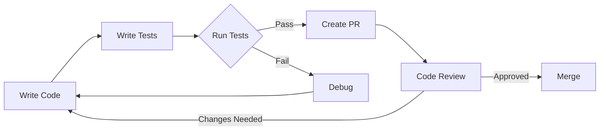
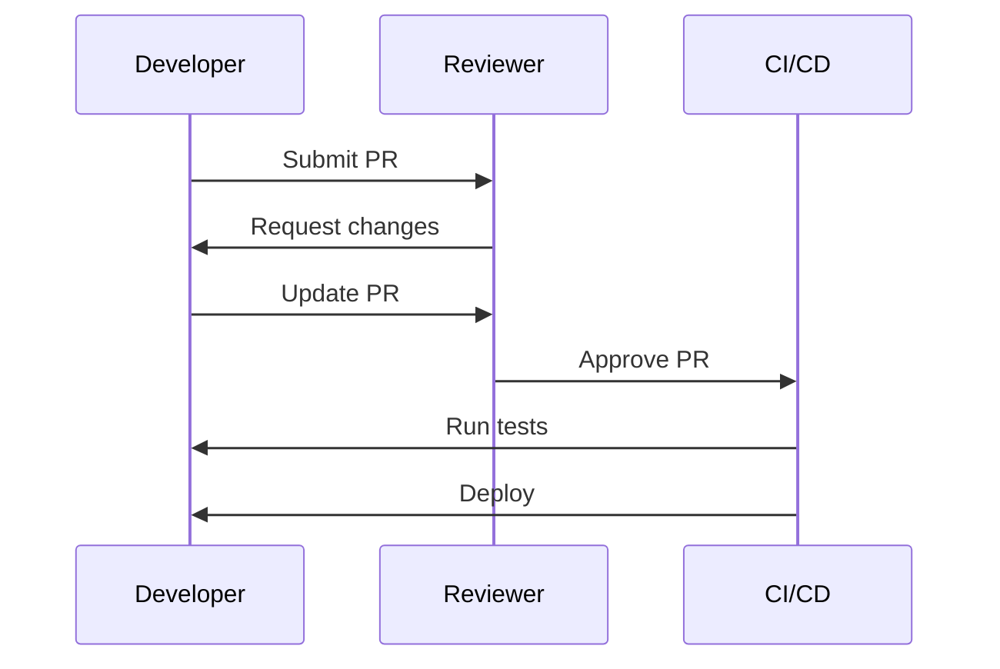
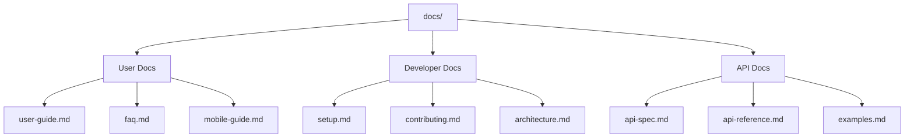
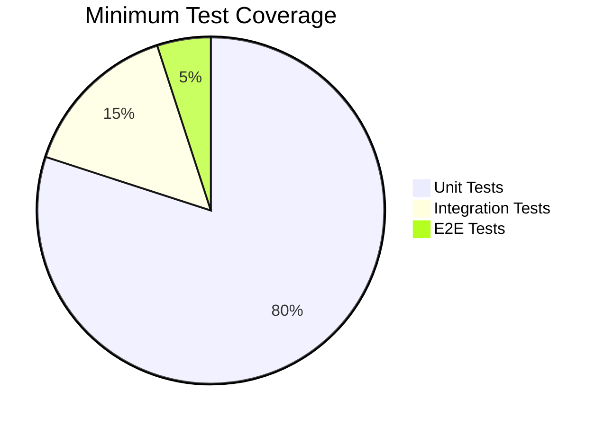
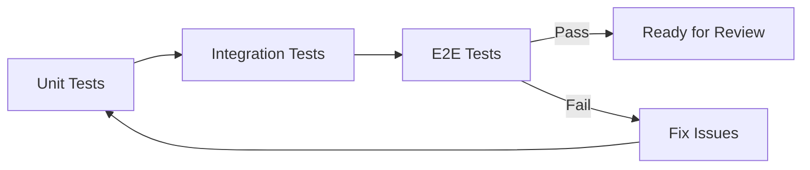
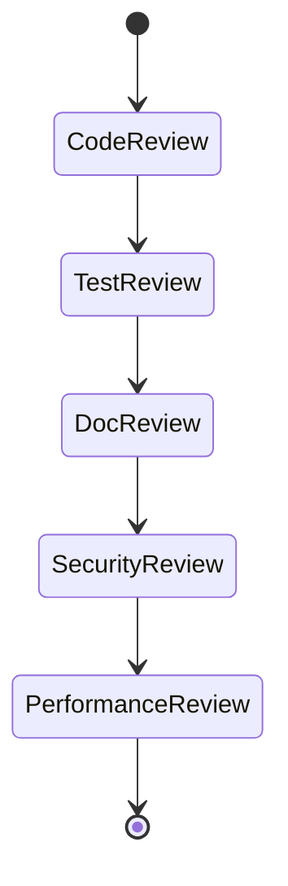
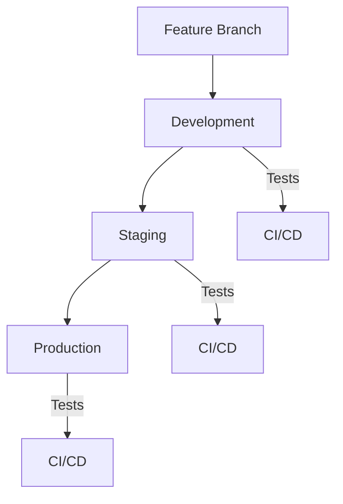

# Contributing to Language Learning Portal

This guide explains how to contribute to the Language Learning Portal project, whether you're fixing bugs, improving documentation, or adding new features.

## Contribution Workflow



## Development Setup

1. **Fork and Clone**
   ```bash
   git clone https://github.com/your-username/lang-portal.git
   cd lang-portal
   ```

2. **Set Up Development Environment**
   ```bash
   # Backend setup
   cd backend
   python -m venv venv
   source venv/bin/activate  # or .\venv\Scripts\activate on Windows
   pip install -r requirements-dev.txt

   # Frontend setup
   cd ../frontend
   npm install
   ```

## Project Architecture



## Testing Workflow



## Code Review Process



## Documentation Standards

### File Structure


## Making Changes

### 1. Create a Branch
```bash
git checkout -b feature/your-feature-name
# or
git checkout -b fix/your-bug-fix
```

### 2. Make Changes
- Follow code style guidelines
- Add tests for new features
- Update documentation
- Add comments for complex logic

### 3. Commit Changes
```bash
# Good commit messages
git commit -m "feat: add user progress tracking"
git commit -m "fix: resolve mobile layout issues"
git commit -m "docs: update API documentation"
```

## Testing Guidelines

### Test Coverage Requirements



### Testing Flow



## Documentation Requirements

### For Features
1. Technical documentation
2. User guide updates
3. API documentation
4. Example usage
5. Test cases

### For Bug Fixes
1. Description of the bug
2. Steps to reproduce
3. Solution explanation
4. Test cases

## Review Checklist



### Code Review
- [ ] Follows style guide
- [ ] No hardcoded values
- [ ] Error handling
- [ ] Input validation

### Test Review
- [ ] Unit tests added/updated
- [ ] Integration tests if needed
- [ ] Edge cases covered
- [ ] Meets coverage requirements

### Documentation Review
- [ ] Updated relevant docs
- [ ] Clear commit messages
- [ ] Code comments
- [ ] API documentation

### Security Review
- [ ] Input sanitization
- [ ] Authentication/Authorization
- [ ] Data validation
- [ ] No sensitive data exposure

### Performance Review
- [ ] No N+1 queries
- [ ] Proper indexing
- [ ] Caching where appropriate
- [ ] Resource optimization

## Getting Help

Need help with your contribution? Here are your options:

1. **Questions about implementation**
   - Create a draft PR
   - Tag relevant reviewers
   - Ask in #dev-help channel

2. **Technical issues**
   - Check troubleshooting guide
   - Ask in GitHub discussions
   - Contact core team

3. **Documentation questions**
   - Check style guide
   - Ask in #docs channel
   - Reference examples

## Release Process



Remember: Quality contributions make the portal better for everyone! 