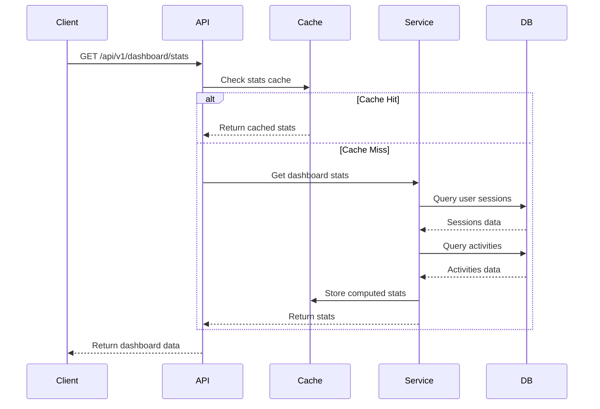
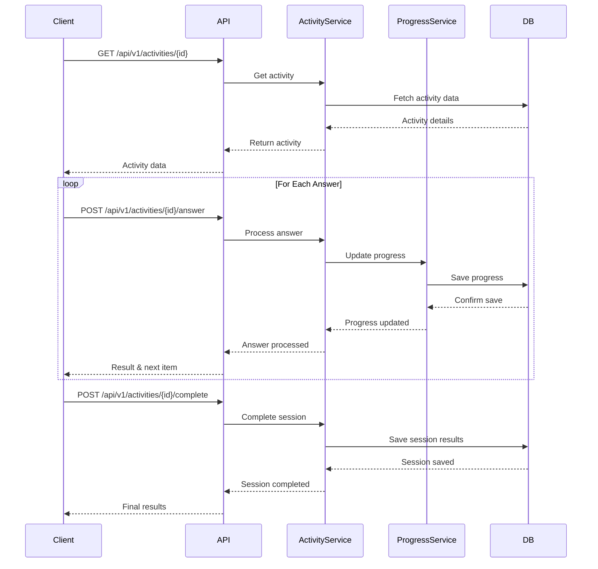
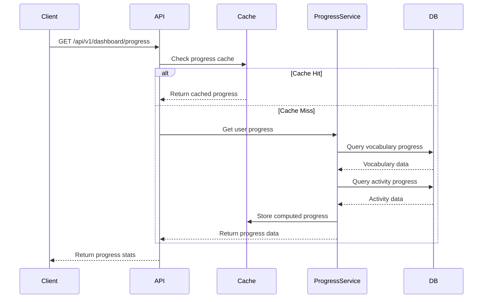
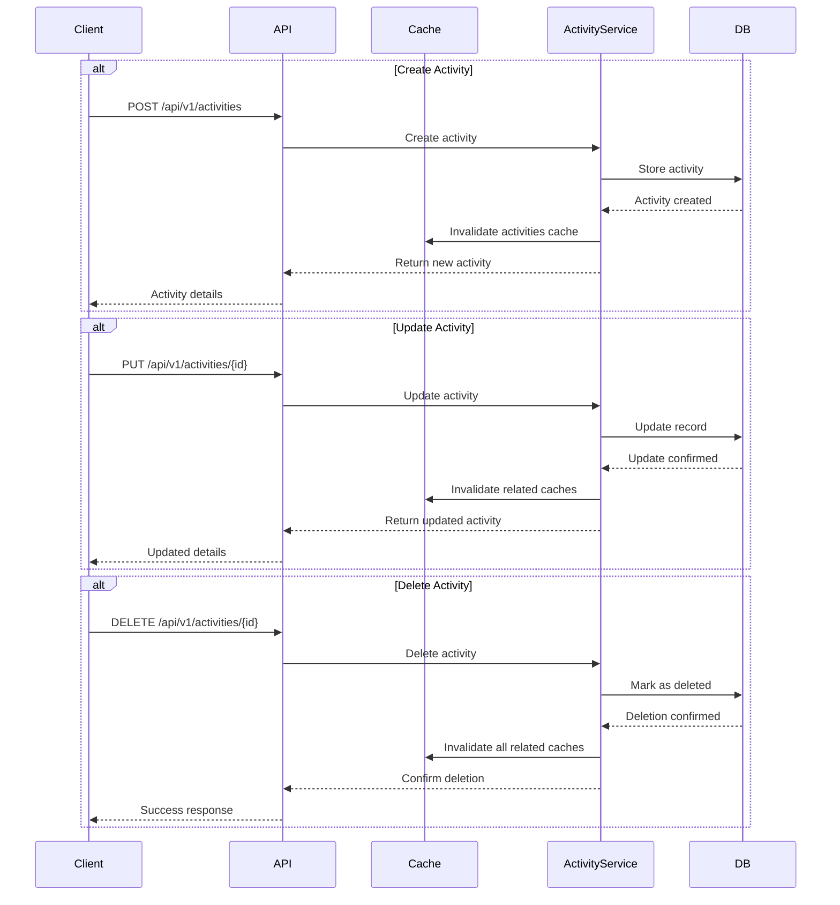
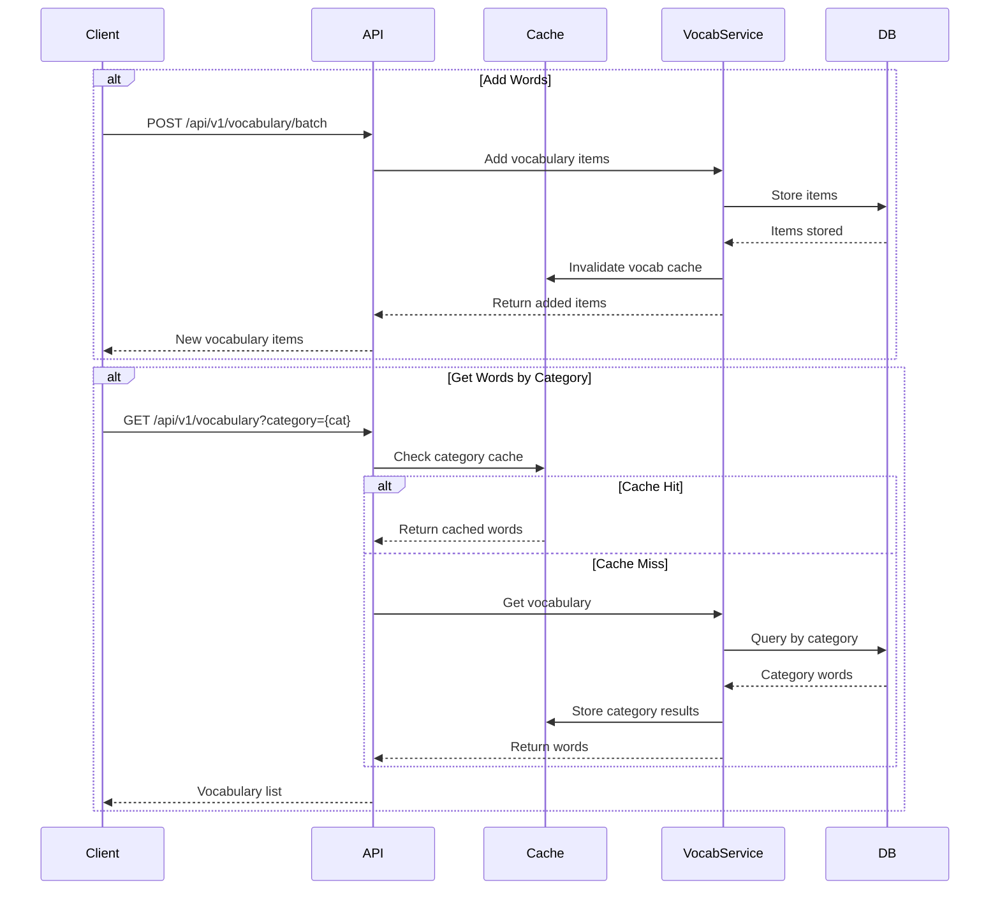
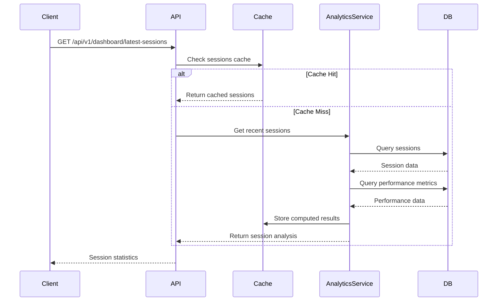
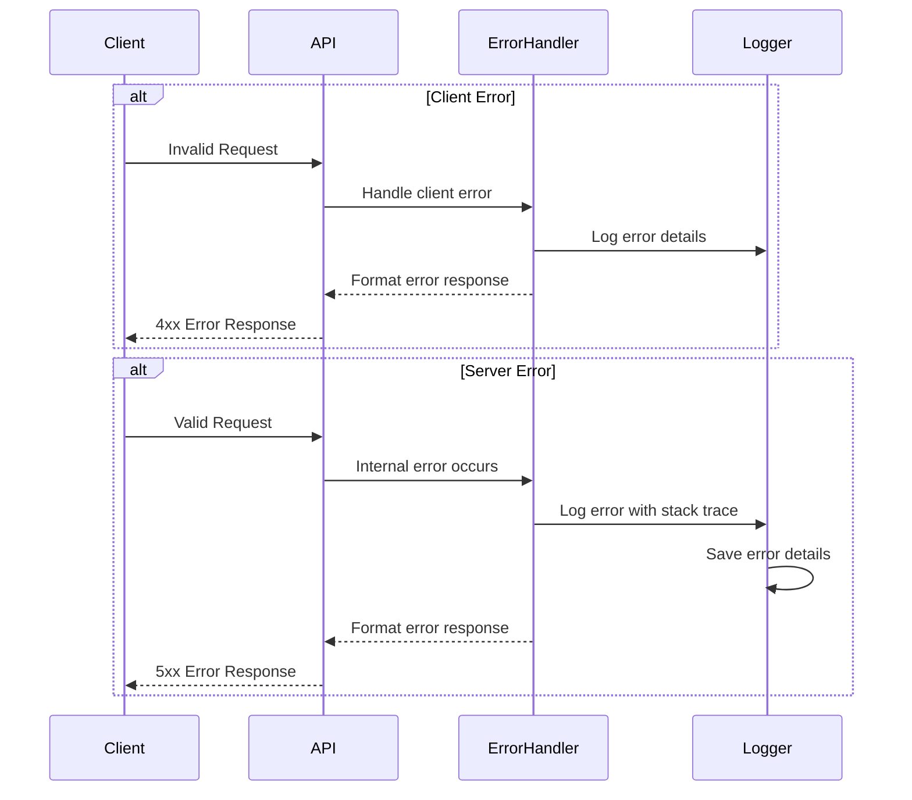
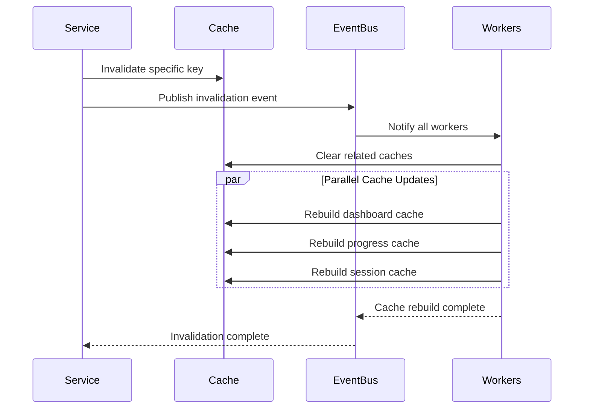

# API Workflows

This document outlines the key API workflows in the Language Learning Portal, showing how different components interact during common operations.

## Dashboard Data Flow

## Learning Session Workflow

## Progress Tracking Flow

## Activity Management Flow

## Vocabulary Management Flow

## Session Analysis Flow

## Error Handling Flow

## Cache Invalidation Flow

These workflow diagrams illustrate the main API interactions in our system. They show:
- Data flow between components
- Caching strategies
- Error handling
- Cache invalidation patterns
- Service interactions

For specific endpoint details, refer to the API reference documentation. 