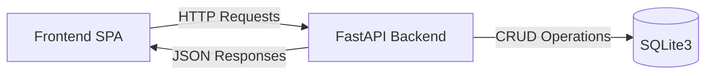
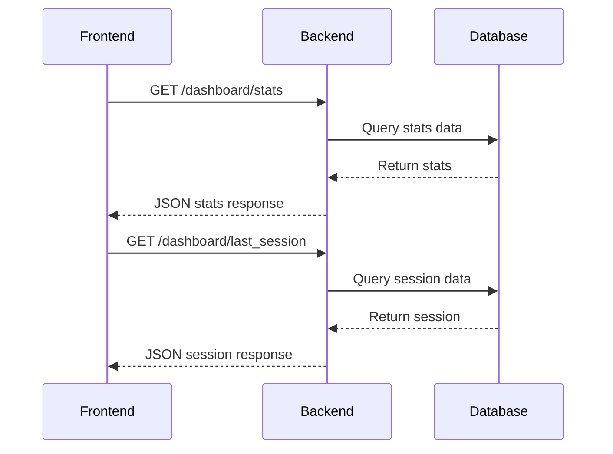
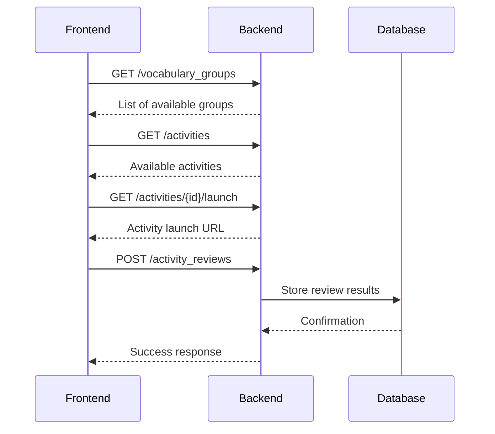
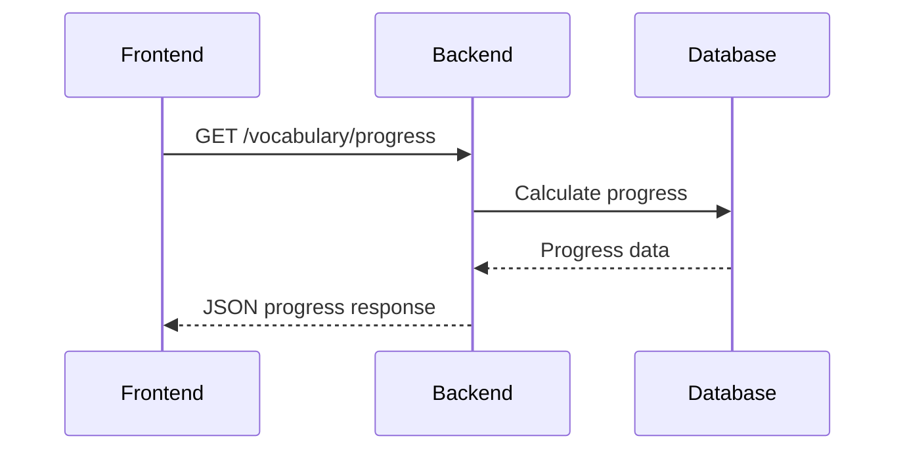

## 1 Data Flow Diagram

## 2 Key Interactions

### A Dashboard View


### Learning Session Flow


### Progress Tracking


## 3 API Response Format
	
```json
{
    "success": true,
    "data": {
        // Endpoint specific data
    },
    "error": null,
    "metadata": {
        "timestamp": "2024-03-21T10:00:00Z",
        "pagination": {
            "total": 100,
            "page": 1,
            "per_page": 20
        }
    }
}
```

## 4 Error Response Format

```json
{
    "success": false,
    "data": null,
    "error": {
        "code": "ERROR_CODE",
        "message": "Human readable error message",
        "details": {}
    },
    "metadata": {
        "timestamp": "2024-03-21T10:00:00Z"
    }
}
```
