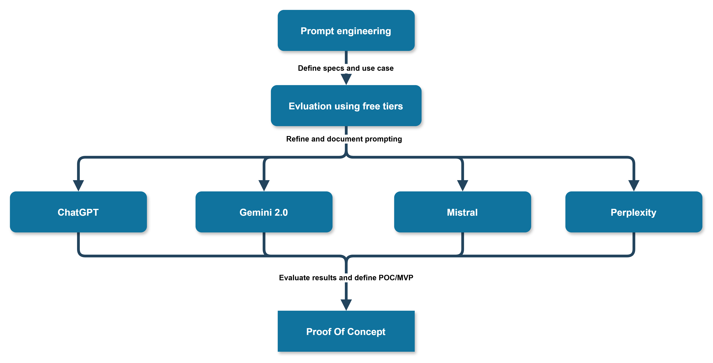

# Folder containing homework for bootcamp preweek

## Sentence Constructor: A German Language Teacher

This folder contains subfolders for the 4 evaluation candidates we used to build our prompt-engineering baseline. These folders are empty because we have aggregated the work in the results.md file. The sector Evaluation And Validation Process at the end of this file shows the process we are using for the building of our Sentence Constructor solution.

### System Design Considerations

> Business requirements
>>We want to provide our Healthcare related customers a NLP solution for that is taylored to their needs. Primary goal is to use our SwissHOstedSolutions branded national cloud to deliver this. This project of a language learning solution is the POC for a subsequent planning and building of such a system

> Functional Requirements
>>The solution needs to be fully opensource. We have a very sparse budget (goes towards zero) and we need to use what we can find on free tiers and on already owned hardware.

>Assumptions
>>We are assuming, that we primarily will use huggingface models and two VPS servers in a datacenter in Zurich. We think we can use the tiiuae/Falcon and tiiuae/Falcon2 models. We plan to use RAG and fine-tuning to optimize the model for the German language. We think we can build a dataset out of freely available gernma grammatics and vocabulary sources.

>Conclusions
>>While we would love to use some of the very sophisticated commercial cloud offerings for AI and LLM's, we are financially and operationally constrained to use them. We have to be innovative and find our own ways of doing things.

## Evluation And Validation Process

1 Given the hard constraints in resources and being forced to only use totally free and open source software, how do you plan to improve your ML systems?

2 Will we find good enough opensource models and will we be able to run them locally on mediocre hardware?

3 If not, will be be able to use permanent free tiers of providers to achieve the goal of our use case?

4 How can the transfer from this constrained MVP into a production ready system look like?	

5 What are the challenges of such a transition and how can we fund the transition to paid services?

We need to find a way to evaluate the quality of the generated sentences. In this process we need to find the best way to engineer the prompting. Because of the zero cost restriction we are only able to use free services to achieve this.The following diagram shows the evaluation process for the sentence constructor Proof of concept.

At the end of this process we will have a prompt engineered baseline that will work on a wide variety of AI powered assistants and chatbots. We then have a certain level of confidence that we can use this baseline to build a proof of concept for a production ready system.