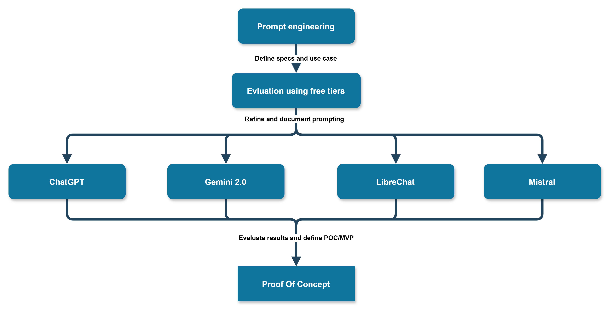

## Sentence Constructor: A German Language Teacher 

## Technical uncertainty

1 Given the hard constraints in resources and being forced to only use totally free and open source software, how do you plan to improve your ML systems?

2 Will we find good enough opensource models and will we be able to run them locally on mediocre hardware?

3 If not, will be be able to use permanent free tiers of providers to achieve the goal of our use case?

4 How can the transfer from this constrained MVP into a production ready system look like?	

5 What are the challenges of such a transition and how can we fund the transition to paid services?

### Evluation and validation process

We need to find a way to evaluate the quality of the generated sentences. In this process we need to find the best way to engineer the prompting. Because of the zero cost restriction we are only able to use free services to achieve this.The following diagram shows the evaluation process for the sentence constructor Proof of concept.

At the end of this process we will have a prompt engineered baseline that will work on a wide variety of AI powered assistants and chatbots. We then have a certain level of confidence that we can use this baseline to build a proof of concept for a production ready system.